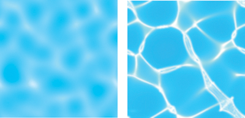
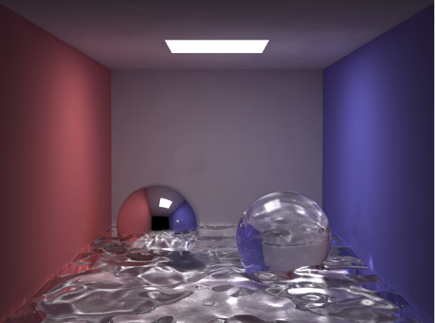

# Final Project Proposal
## Photon Mapping
Shuyang Zhang & Yaran Yang

In the final project for CSE 168, we plan to do a photon mapping to achieve rendering under water. Photon Mapping is a global illumination technique that could render some scene with Caustic Phenomenon, for example, the light streak on the bottom of the water.

- Example of water caustics:
  

[Image Reference](https://developer.nvidia.com/gpugems/gpugems/part-i-natural-effects/chapter-2-rendering-water-caustics)

Our "hero" image is the water caustic render image

[Image Reference](https://graphics.stanford.edu/courses/cs348b-00/course8.pdf)

## Steps 

### Creating a photon map

- Generate photon information(Sampling photon)
  - For different kinds of light, generate the initial photon’s origin position,emit  direction and power, record this information(According to Monte-Carlo). 
- Reflect and refract photon 
  - Global
    - A photon is emitted from a light source and bounced repeatedly through the scene, recording a photon each time it hits a diffuse surface until it is completely absorbed by a diffuse surface
  - Caustic
    - After passing through at least one total reflection, refraction, and touching a diffuse surface, the photon is recorded in the ma
- Record photon in Kd-tree
  - For Global photon map, record the information of the photon after diffuse reflection; for caustic photon map, record the information when it gets diffuse after specular reflection or refraction. And store these in a kd-Tree so that we can accelerate the process of finding nearby photons in the following steps.
  
### Rendering process
- Global illumination 
  - In global photon mapping, find the nearest photons, get the power of these photons, calculate the energy that photon reflects light, then use this to get the density estimator. Through the density estimator, evaluate the output color at that pixel.
- Caustic illumination
  - The steps are similar to global illumination, but instead of using global photon mapping, using caustic photon mapping. 
- Incorporating path tracer 
  - There are two options for direct lighting
    - Use the global photon mapping contains only one diffuse reflection of the photon as direct illumination
    - Excluding the global photon mapping contains only one diffuse reflection of the photon, use the path tracer as we have implemented before in previous assignment as direct lighting. 

## What we have done 
- Find the way to transfer the .obj file to .test file.
- Generate photon information(Sampling photon)
- Wrote the function of the reflection and refraction of photons.

## Next step we will do
- Modified the BRDF formula so that it would be based on the power of photons
- Build the kd-tree to store the information

## Note
In order to produce an image (even a really simple one), the building of kd-tree is needed, which requires a lot of work and time consuming, which we are unable to complete before the ddl of the milestone.  But we do try our best and start working. TAT

